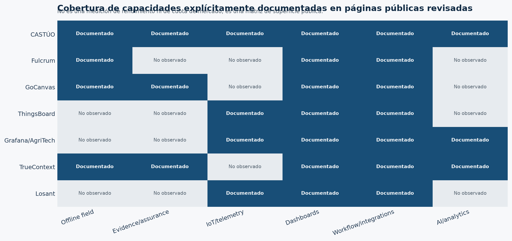

# Análisis competitivo digital de CASTÚO-SYSTEM

**Fecha:** 19 de agosto de 2026  
**Autor:** Manus AI  
**Estado:** `EVIDENCE-SCOPED · PUBLIC SURFACE ANALYSIS`

## Resumen ejecutivo

Este análisis delimita el universo digital comparable de CASTÚO-SYSTEM en seis superficies: operaciones de campo offline-first, field service e integración, IoT/Edge, AgTech, observabilidad y assurance. El resultado no debe leerse como una clasificación de cuota de mercado. La consulta de telemetría SimilarWeb no devolvió métricas utilizables en esta ejecución; por ello, no se publican cifras de visitas, usuarios únicos, ranking, bounce rate, fuentes de tráfico ni distribución geográfica.

La comparación pública sí permite identificar una posición diferenciada: **CASTÚO combina continuidad offline-first, evidencia reproducible, gates fail-closed y gobierno de promoción**, mientras que las superficies comparadas tienden a especializarse en una de estas capas: captura GIS de campo, automatización de formularios, telemetría IoT, dashboards agrícolas o inteligencia de field service. Esta conclusión es una inferencia estratégica basada en las páginas revisadas, no una afirmación de superioridad de producto.

> **Frontera de claims:** la presencia de una capacidad en una página pública no demuestra producción, seguridad independiente, resultados de clientes, escala operativa ni interoperabilidad real.

## 1. Universo competitivo delimitado

| Segmento | Dominios revisados | Motivo de inclusión |
|---|---|---|
| Campo offline/GIS | `fulcrumapp.com` | Presenta formularios, mapas, GPS y operación offline para equipos de campo. |
| Field service / workflow | `gocanvas.com`, `prontoforms.com` | Presentan captura móvil, automatización, integraciones, reporting e inteligencia operativa. |
| IoT / Edge | `thingsboard.io`, `losant.com` | Presentan telemetría, protocolos, workflows, edge agents, digital twins y visualización. |
| AgTech / observabilidad | `grafana.com` | Publica un caso de agricultura con sensores, dashboards locales/cloud y automatización. |
| Sistema analizado | `github.com/Traky12/Traky12` | Superficie pública de CASTÚO con capability envelope y límites de evidencia explícitos. |

El universo es **bounded**, no exhaustivo. Se priorizaron superficies que comparten al menos una de las funciones relevantes para CASTÚO: continuidad en campo, integración de datos, telemetría distribuida, observabilidad, evidencia o assurance.

## 2. Cobertura de capacidades observada públicamente



La matriz clasifica únicamente si la página revisada describe explícitamente una capacidad. `Documentado` no equivale a verificado y `No observado` significa que no se encontró en la superficie consultada, no que la organización carezca de esa capacidad.

| Superficie | Capacidades explícitas observadas | Límite de lectura |
|---|---|---|
| CASTÚO | Offline continuity, evidence fabric, assurance/recovery, Edge/IoT experimental, workflow governance y AI advisory | El README mantiene producción, certificación, field, federation y commercial validation como `NOT_CLAIMED` o pendientes. |
| Fulcrum | Offline GIS, formularios, mapas, GPS, validación y sincronización | La evidencia revisada es comercial y descriptiva; no se auditó operación independiente. |
| GoCanvas | Captura online/offline, workflows, integraciones, dashboards, roles, auditoría y seguridad | Claims de integraciones, certificaciones y resultados proceden de la propia superficie comercial. |
| ThingsBoard | Sensores agrícolas, MQTT/CoAP/HTTP/Modbus, rule chains, alertas, control y dashboards | Describe una solución IoT; no demuestra un resultado operativo concreto de CASTÚO. |
| Grafana/AgriTech | Telemetría agrícola, dashboards, automatización, energía y edge/local deployment | El caso y sus cifras son una publicación del proveedor y no una validación independiente. |
| TrueContext | Formularios contextuales, datos AI-ready, analítica asistida, integraciones bidireccionales y gobernanza empresarial | Los claims de usuarios, ahorros, ratings y seguridad requieren due diligence separada. |
| Losant | Workflow IoT, integración, visualización, edge agent, PLC/CRM/cloud, multi-tenancy y digital twins | La capacidad descrita es de plataforma; no se comprobó la ejecución de un caso CASTÚO. |

## 3. Posicionamiento estratégico evidence-scoped

CASTÚO no debe competir inicialmente por amplitud de funcionalidades frente a plataformas maduras de formularios, IoT o dashboards. Su wedge más defendible es una **capa de continuidad y assurance para operaciones distribuidas**, en la que la pérdida de conectividad, la preservación de evidencia, la reproducción por un tercero y la decisión de promoción son requisitos de primer nivel.

| Dimensión | Oportunidad de posicionamiento para CASTÚO | Prueba que debe cerrarse antes de elevar el claim |
|---|---|---|
| Offline-first | Diferenciarse de la simple captura offline mediante continuidad, sincronización y replay verificable | Remote conformance, foreign replay y KPI `CONTINUITY-001` |
| Evidence-ready | Convertir manifests, hashes, negativos y recovery en un producto visible, no solo en documentación | Evidence Pack público con reproducción por operador distinto |
| Assurance | Hacer del fail-closed y de los gates una propiedad comercial verificable | Security Baseline v1, revisión humana e independiente y recuperación ejercitada |
| Edge/IoT | Conectar telemetría rural con el mismo envelope de evidencia | Integración core, dispositivo/workflow nombrado y KPI medible |
| AI gobernada | Mantener AI en advisory/dry-run con política y revisión humana | Caso independiente validado; no reclamar decisión autónoma |
| Vendor exit | Presentar portabilidad y sustitución de proveedores como continuidad operacional | Replay entre proveedores o entornos con artefactos comparables |

La recomendación es posicionar el producto como **“evidence-ready continuity for disconnected field operations”** y evitar competir en esta etapa por claims genéricos de “plataforma IoT”, “IA autónoma” o “producción resiliente” sin evidencia externa.

## 4. Estado de la telemetría SimilarWeb

Se intentó consultar, para el universo delimitado, visitas totales, bounce rate, fuentes de tráfico y tráfico por país. La API respondió con una precondición de acceso antes de ejecutar las llamadas. En consecuencia:

| Métrica | Estado | Tratamiento en este informe |
|---|---|---|
| Visitas mensuales | `NO_OBSERVED` | No publicada ni estimada. |
| Usuarios únicos | `NO_OBSERVED` | No publicada ni estimada. |
| Bounce rate | `NO_OBSERVED` | No publicada ni estimada. |
| Ranking global | `NO_OBSERVED` | No publicado ni estimado. |
| Fuentes de tráfico | `NO_OBSERVED` | No publicado ni estimado. |
| Países | `NO_OBSERVED` | No publicado ni estimado. |
| Capacidades descritas públicamente | `OBSERVED` | Utilizadas solo para la matriz cualitativa. |

No se deben convertir descripciones de marketing en métricas de demanda, adopción, conversión, retención o liderazgo competitivo. Para cerrar el análisis cuantitativo se requiere una ejecución posterior con telemetría SimilarWeb disponible o una fuente autorizada equivalente, conservando fecha, rango, dominio, endpoint, respuesta y hash del artefacto.

## 5. Acciones recomendadas para CASTÚO

La acción prioritaria es publicar un **competitive evidence pack** que compare un mismo vertical slice: crear una operación, perder conectividad, continuar localmente, recuperar conexión, sincronizar, exportar y reproducir el paquete de evidencia. Esto debe medirse con un protocolo idéntico para CASTÚO y, únicamente cuando sea legal y técnicamente posible, con productos comparables.

A continuación, CASTÚO debe convertir la ventaja narrativa en señales públicas verificables: una demo reproducible, fixtures, hashes reales, un replay extranjero, un informe de recovery y una decisión independiente de assurance. El lenguaje comercial debe seguir siendo bounded: `implemented within declared scope`, `experimental`, `target` o `not claimed`.

En paralelo, la superficie pública debería separar con claridad tres capas: **continuidad de campo**, **assurance/evidence** y **Edge/IoT experimental**. Esta taxonomía evita que el mercado interprete integraciones o arquitectura objetivo como producción ya validada.

## 6. Estado final y no-claims

```text
COMPETITIVE UNIVERSE: DEFINED · BOUNDED
PUBLIC CAPABILITY REVIEW: COMPLETE
SIMILARWEB QUANTITATIVE TELEMETRY: NOT OBSERVED IN THIS RUN
QUALITATIVE MATRIX: GENERATED AND VERIFIED
CASTÚO POSITIONING: EVIDENCE-READY CONTINUITY FOR DISCONNECTED FIELD OPERATIONS
PRODUCTION / CERTIFICATION / MARKET LEADERSHIP: NOT_CLAIMED
```

Este documento no cambia el estado de promoción del sistema. El perfil permanece en `GREEN-STAGING · EVIDENCE-SCOPED`; la promoción del sistema continúa bloqueada hasta cerrar evidencia remota, revisión humana, Security Baseline, E3 independiente, vertical slice y demás gates definidos en el README.

## Referencias

[1]: https://github.com/Traky12/Traky12/blob/main/README.md "CASTÚO-SYSTEM public profile README"
[2]: https://www.fulcrumapp.com/resources/data-sheet/offline-gis-built-for-the-field/ "Fulcrum — Field-first offline GIS"
[3]: https://www.gocanvas.com/ "GoCanvas — Field Operations Platform"
[4]: https://thingsboard.io/use-cases/smart-farming/ "ThingsBoard — Smart Farming IoT"
[5]: https://grafana.com/success/agritech/ "Grafana — AgriTech case study"
[6]: https://www.prontoforms.com/ "ProntoForms / TrueContext — Field intelligence platform"
[7]: https://www.losant.com/ "Losant — Enterprise IoT Platform"
